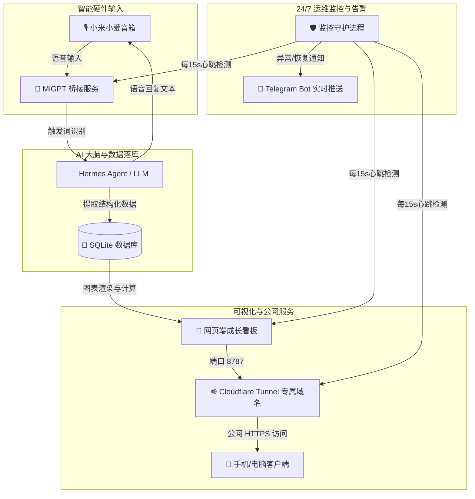

# 🍼 童童成长助手 (Baby Tracker & Smart Speaker AI Assistant)

> 专为新手父母打造的 **AI 语音记账 + 实时可视化看板 + 全自动运维守护** 系统。  
> 抱娃时直接向智能音箱口述，彻底解放双手；网页端实时渲染生长发育曲线与 AI 气泡对话；后台常驻进程提供 24/7 稳定性监控与 Telegram 异常告警。

---

## 💡 为什么需要这个项目？（核心价值与设计初衷）

在新手父母照顾婴儿的真实日常中，**双手往往长期处于被占用状态**（抱娃、喂奶、拍嗝、安抚）。传统的育儿 App 记账存在天然的体验痛点：
- ❌ **传统 App 痛点**：半夜昏昏沉沉或双手抱着孩子时，需要解锁手机、找到应用、多级点击并手动打字输入，繁琐且极易漏记。
- ❌ **市面上音箱局限**：普通智能音箱无法自动做结构化数据分类存储，更无法与多维生长发育曲线和自动上下文计算（如离上一顿奶多久、今天奶粉总毫升数）结合。

### 🌟 本项目的核心价值与突破：
1. 🎙️ **解放双手的无感语音交互（真正的 Hands-Free）**  
   抱娃时只需对着房间里的音箱说一句：*“小爱同学，小赫，记录喂奶 180ml”* 或 *“童童拉臭臭了”*，AI 自动识别语义并完成结构化落库，**将记账摩擦力降为零**。
2. 🧠 **智能上下文计算与口语化解答**  
   不仅能记，还能“算”与“答”。对音箱或网页随口问 *“童童今天喝了多少奶粉”* 或 *“上一顿奶是什么时候吃的”*，AI 大脑会自动查询数据库做时间差计算与汇总，并用极具人情味的简短口语解答。
3. 📊 **多维发育指标与自动化提醒闭环**  
   自动计算四指标（身高、体重、头围、胸围）百分位对照、下一次打疫苗/体检倒计时，数据变动秒级自动刷新网页图表，全家共享同一个实时面板。
4. 🛡️ **工业级 24/7 常驻保活与防误报告警**  
   具备完整防丢包/消抖机制，Cloudflare 域名安全曝光，配合 Telegram 自动化通知，打造一套极具稳定性的个人家庭级 AI 架构典范。

---

## 🏗️ 典范全栈架构（Architecture Blueprint）

这是一个非常典范的 **AI Agent + IoT 智能硬件 + 本地优先 + 边缘网关 + 可视化看板** 全栈工程实践：

- **🎙️ 硬件层**：MiGPT 桥接小米小爱音箱，处理语音唤醒词匹配、音频打断与高并发对答机制；
- **🧠 大脑层**：Hermes Agent 结合大语言模型（LLM），支持自然语言意图提取、结构化解析、时间差分析与口语化解答；
- **💾 数据与展示**：SQLite 本地轻量化存储 + Chart.js 自动化生长发育曲线渲染 + 网页端常驻 AI 交互气泡；
- **🛡️ 运维层**：Cloudflare Named Tunnel 域名安全曝光 + 独立进程 24/7 常驻保活 + Telegram 异常消抖告警。

---

## ✨ 核心特性

- 🎙️ **解放双手的智能语音记账**  
  抱娃/喂奶时直接对小米小爱音箱口述（如 *“小爱同学，小赫，记录喂奶 180ml”* 或 *“童童拉臭臭了”*），系统自动识别唤醒词并完成结构化落库。
- 📊 **四指标发育曲线与倒计时看板**  
  网页端展示身高、体重、头围、胸围最新数值及与世卫组织/国标百分位对照，自动倒计时提示下一次打疫苗与体检时间。
- 💬 **网页端双向 AI 气泡助手**  
  网页端嵌入常驻 AI 对答气泡，随时询问 *“今天喝了多少奶”* 或 *“上一顿奶是什么时候吃的”*，AI 自动查询数据库并以自然语言口语化解答。
- 🛡️ **独立常驻后台与 Telegram 告警控制台**  
  提供专用的 `/status.html` 服务监控控制台，具备**消抖防误报**机制与自动拉起恢复能力。当服务异常时自动通过 Telegram 向手机发送实时警报。

---

## 🏗️ 系统架构图



---

## 📋 环境要求与前置准备

### 1. 📢 硬件设备
* **小米智能音箱**：支持语音唤醒的小米小爱音箱（推荐 *Xiaomi 智能音箱 Pro / 小爱音箱 Play / 小爱触屏音箱* 等）；
* **常驻运行主机**：任意 24 小时不间断运行的主机（MacBook / Linux 服务器 / 树莓派 / 软路由 NAS / Windows WSL2），用于常驻后台 Agent 与看板服务。

### 2. 💻 软件与运行环境
* **Node.js**：`v18.0.0` 或更高版本（用于运行 MiGPT-Next 小爱音箱桥接引擎）；
* **Python**：`v3.9` 或更高版本（用于运行 Hermes Agent AI 大脑、SQLite 数据落库、看板渲染与 24/7 健康监控守护进程）；
* **Git**：用于代码拉取与版本管理。

### 3. 🔑 云端服务与账号凭据
* **小米家庭账号**：账号名与密码（用于 MiGPT 接入小爱音箱 API）；
* **LLM / Hermes Agent**：OpenAI API Key / DeepSeek / Claude / Local LLM 密钥（用于 AI 自然语言理解与分析）；
* **Cloudflare 账号（选填）**：Cloudflare Named Tunnel Token（用于生成全网免费可访问的固定 HTTPS 域名，未配置则使用免费 Quick Tunnel 随机域名）；
* **Telegram Bot（选填）**：Telegram Bot Token 与 Chat ID（用于接收 24/7 监控报警与自动恢复通知）。

---

## 🛠️ 快速开始

### 1. 克隆仓库与准备环境
```bash
git clone https://github.com/your-username/baby-tracker.git
cd baby-tracker

# 安装 Node.js 依赖 (MiGPT)
cd migpt-next/apps/example && npm install

# 准备 Python 虚拟环境 (Hermes Agent)
python3 -m venv venv
source venv/bin/activate
pip install -r requirements.txt
```

### 2. 配置环境变量
复制 `.env.example` 模版并填入您的真实凭据：
```bash
cp .env.example .env
```

配置说明：
* `XIAOMI_USER_ID` / `XIAOMI_PASSWORD`: 小米智能家庭账号密码
* `CLOUDFLARE_TUNNEL_TOKEN`: Cloudflare Tunnel 专属 Token（选填）
* `TELEGRAM_ALERT_TARGET`: Telegram 通知目标 ID

### 3. 一键拉起后台守护服务
```bash
bash start_baby_services.sh
```

服务启动后：
- 🍼 **成长数据看板**：访问 `http://127.0.0.1:8787/` 或您的 Cloudflare 固定域名
- 🛡️ **系统监控控制台**：访问 `http://127.0.0.1:8787/status.html`

---

## 📁 目录结构

```
.
├── start_baby_services.sh       # 全套服务常驻启动脚本
├── stop_baby_services.sh        # 全套服务停止脚本
├── run_migpt_daemon.sh          # MiGPT Node.js 自动保活循环
├── .env.example                 # 环境变量模板
├── .gitignore                   # Git 泄露防护过滤文件
├── README.md                    # 项目说明文档
└── migpt-next/                  # MiGPT 音箱桥接模块
```

---

## 🔒 隐私与安全说明

为了保护宝宝与家庭隐私：
- 任何真实个人 SQLite 数据库 (`*.db`)、`.env` 配置文件与日志文件均已被 `.gitignore` 严格隔离，**绝不提交至公开代码仓库**。
- 请在自行部署前严格检查并擦除配置文件中的真实密钥与凭据。

---

## 📄 License
MIT License
