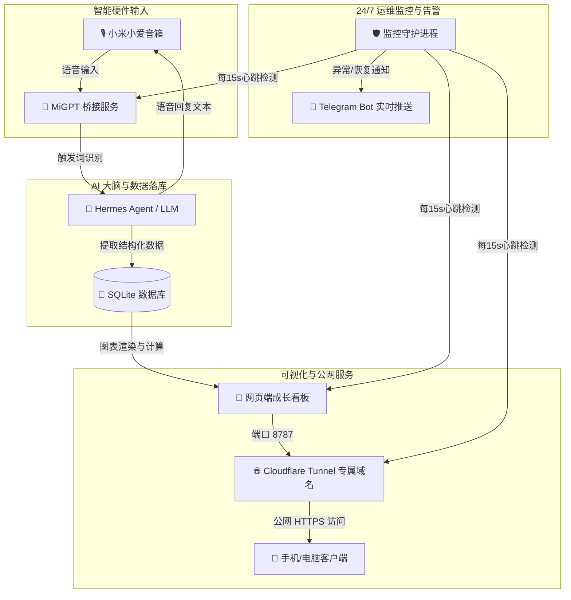

# 🍼 童童成长助手 (Baby Tracker & Smart Speaker AI Assistant)

> 专为新手父母打造的 **AI 语音记账 + 实时可视化看板 + 全自动运维守护** 系统。  
> 抱娃时直接向智能音箱口述，彻底解放双手；网页端实时渲染生长发育曲线与 AI 气泡对话；后台常驻进程提供 24/7 稳定性监控与 Telegram 异常告警。

---

## ✨ 核心特性

- 🎙️ **解放双手的智能语音记账**  
  抱娃/喂奶时直接对小米小爱音箱口述（如 *“小爱同学，小赫，记录喂奶 180ml”* 或 *“童童拉臭臭了”*），系统自动识别唤醒词并完成结构化落库。
- 📊 **四指标发育曲线与倒计时看板**  
  网页端展示身高、体重、头围、胸围最新数值及与世卫组织/国标百分位对照，自动倒计时提示下一次打疫苗与体检时间。
- 💬 **网页端双向 AI 气泡助手**  
  网页端嵌入常驻 AI 对答气泡，随时询问 *“今天喝了多少奶”* 或 *“上一顿奶是什么时候吃的”*，AI 自动查询数据库并以自然语言口语化解答。
- 🛡️ **独立常驻后台与 Telegram 告警控制台**  
  提供专用的 `/status.html` 服务监控控制台，具备**消抖防误报**机制与自动拉起恢复能力。当服务异常时自动通过 Telegram 向手机发送实时警报。

---

## 🏗️ 系统架构图



---

## 🛠️ 快速开始

### 1. 克隆仓库与准备环境
```bash
git clone https://github.com/your-username/baby-tracker.git
cd baby-tracker

# 安装 Node.js 依赖 (MiGPT)
cd migpt-next/apps/example && npm install

# 准备 Python 虚拟环境 (Hermes Agent)
python3 -m venv venv
source venv/bin/activate
pip install -r requirements.txt
```

### 2. 配置环境变量
复制 `.env.example` 模版并填入您的真实凭据：
```bash
cp .env.example .env
```

配置说明：
* `XIAOMI_USER_ID` / `XIAOMI_PASSWORD`: 小米智能家庭账号密码
* `CLOUDFLARE_TUNNEL_TOKEN`: Cloudflare Tunnel 专属 Token（选填）
* `TELEGRAM_ALERT_TARGET`: Telegram 通知目标 ID

### 3. 一键拉起后台守护服务
```bash
bash start_baby_services.sh
```

服务启动后：
- 🍼 **成长数据看板**：访问 `http://127.0.0.1:8787/` 或您的 Cloudflare 固定域名
- 🛡️ **系统监控控制台**：访问 `http://127.0.0.1:8787/status.html`

---

## 📁 目录结构

```
.
├── start_baby_services.sh       # 全套服务常驻启动脚本
├── stop_baby_services.sh        # 全套服务停止脚本
├── run_migpt_daemon.sh          # MiGPT Node.js 自动保活循环
├── .env.example                 # 环境变量模板
├── .gitignore                   # Git 泄露防护过滤文件
├── README.md                    # 项目说明文档
└── migpt-next/                  # MiGPT 音箱桥接模块
```

---

## 🔒 隐私与安全说明

为了保护宝宝与家庭隐私：
- 任何真实个人 SQLite 数据库 (`*.db`)、`.env` 配置文件与日志文件均已被 `.gitignore` 严格隔离，**绝不提交至公开代码仓库**。
- 请在自行部署前严格检查并擦除配置文件中的真实密钥与凭据。

---

## 📄 License
MIT License
